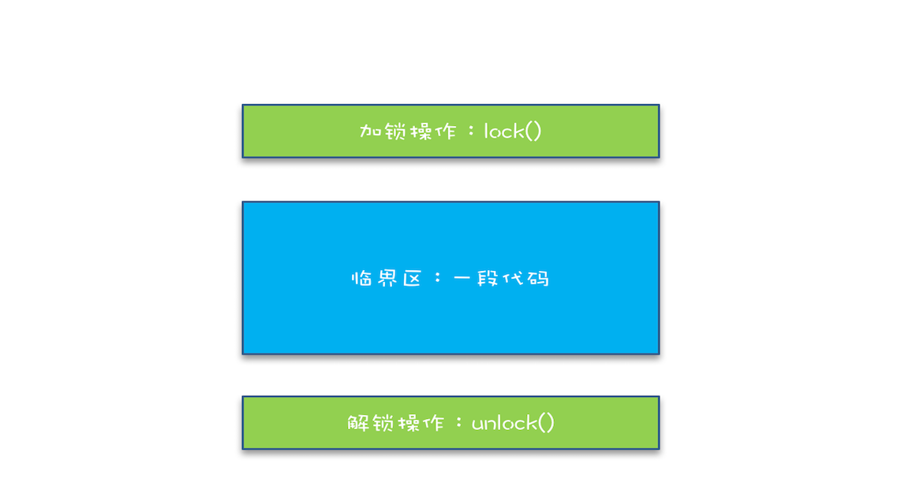

# Java 并发编程

[TOC]

## 并发编程概述

### 并发编程的三个核心问题

- 分工：任务的拆解，安排线程执行。
- 同步：被拆解的任务之间存在依赖，必须协调线程之间的关系保证程序的正确执行。
- 互斥：控制同一时刻只允许一个线程访问共享变量。


**并发编程全景图**


### 钻进去，看本质

&emsp;工程上的解决方案，一定要有理论作为基础。遇到一个问题一定要刨根问底，比如“它是从哪儿来的？”，是java的特有概念还是通用的概念。“它被提出的背景和解决的问题是什么？”等等。


## 1.并发编程Bug的源头：可见性、原子性和有序性问题

&emsp;为了提高CPU的使用率，平衡CPU、内存、I/O设备这三者的速度差异，计算机体系结构、操作系统、编译程序都做出了如下改进：

- CPU增加了缓存，以均衡与内存的速度差异；
- 操作系统增加了进程、线程，以时分复用CPU，进而均衡CPU与I/O设备的速度差异；
- 编译程序优化指令执行次序，使得缓存能够得到更加合理地利用。

&emsp;当这三方面的改进也带来了相应的问题。

### （1）多核CPU下，缓存导致的可见性问题

&emsp;**可见性：**一个线程对共享变量的修改，另外一个线程能够立刻看到，称为可见性。

&emsp;多核CPU下，每颗CPU都有自己的缓存，如下图所示，线程A操作CPU-1上的缓存，线程B操作CPU-2上的缓存，此时某个线程对共享变量V的操作对于另一个线程而言不具备可见性。


### （2）线程切换带来的原子性问题

&emsp;**原子性：**把一个或者多个操作在CPU执行的过程中不被中断的特性称为原子性。

&emsp;一条高级语言的语句往往对应多个指令，如下图所示，而如果在指令的执行过程中进行了线程切换，可能会导致执行结果出错。


### （3）编译优化带来的有序性问题

&emsp;**有序性：**指的是程序按照代码的先后顺序执行，但是编译器为了优化性能，有时候会改变程序中语句的先后顺序，这可能会带来Bug。

&emsp;如下面利用双重检查创建单例对象的代码：

```java
public class Singleton {
  static Singleton instance;
  static Singleton getInstance(){
    if (instance == null) {
      synchronized(Singleton.class) {
        if (instance == null)
          instance = new Singleton();
        }
    }
    return instance;
  }
}
```

&emsp;对于上面的程序，如果new 操作执行顺序如果被优化过可能会出问题，**原顺序：**

- 分配一块内存；
- 在内存M上初始化Singleton对象；
- 然后M的地址赋值给instance变量。

**优化后的顺序：**

- 分配一块内存；
- 将M的地址赋值给instance变量；
- 最后在内存M上初始化Singleton对象。

其可能出现的问题如下图所示：


## 2.Java 内存模型：解决可见性和有序性问题

&emsp;缓存和编译优化导致了可见性和有序性问题，而我们不可能完全禁用缓存和编译优化。所以为了解决这个两个问题，Java内存模型规范了JVM如何提供**按需禁用缓存和编译优化**的方法。

&emsp;这些方法包括：**volatile、synchronized和final**三个关键字，以及**六项Happens-Before规则**。

### （1）volatile ：禁用CPU缓存

```java
volatile int x = 0;
```

&emsp;上面这条语句是告诉编译器，对于变量x的读写，不能使用CPU缓存，必须从内存中读取或写入。

### （2）Happens-Before 规则

&emsp;用于实现前一个操作的结果对后续操作是可见的。Happens-Before约束了编译器的优化行为，虽允许编译器优化，但是要求编译器优化后一定满足Hapeens-Before 规则。

- 程序的顺序性规则：程序前面对某个变量的修改一定是对后续操作可见的；
- volatile变量规则：对一个volatile变量的写操作，Happens-Before于后续对这个volatile变量的读操作；
- 传递性：如果A Happens-Before B，且B Happens-Before C，那么A Happens-Before C；
- 管程中锁的规则：一个锁的解锁 Happens-Before 于后续对这个锁的加锁。管程在Java 中的实现为synchronized；
- 线程start() 规则：指的是主线程A启动子线程B后，子线程B能看到主线程A在启动子线程前的操作。
- 线程 join() 规则：指的是，子线程B在执行完 B.join() 后，主线程A能够 "看到" 子线程的操作，比如B对于共享变量的操作。
- final：final 修饰的变量，不可改变，可以任编译器随意优化。


## 3.互斥锁：解决原子性问题

&emsp;原子性问题的源头是线程切换，那在允许线程切换的情况下，如何保证操作的原子性呢？如果我们能保证对共享变量的修改是互斥的，那么就能保证原子性。

&emsp;互斥：同一时刻只有一个线程执行。

### （1）锁：简易锁模型

&emsp;我们把一段需要互斥执行的代码称为临界区。线程进入临界区之前需要尝试加锁lock()，如果成功则进入临界区，此时这个线程持有锁；否则就等待直到临界区的线程释放锁；持有锁的线程执行完临界区的代码后，执行解锁unlock()，如下图，类似于“如厕”的场景。



### （2）改进后的锁模型

&emsp;注意锁和要锁的资源是有对应的关系的，在代码中要体现处这种关系。如对于受保护的资源R，为它创建一把锁LR，还需要再进出临界区时天上加锁和解锁操作，如下图所示：


### （3）Java 提供的锁技术：synchronized

&emsp;synchronized 关键字是锁的一种体现，可以用来修饰方法和代码块，如下所示。Java 编译器会在synchronized修饰的方法或代码块前后自动加上加锁和解锁操作，好处就是这两个操作一定会成对出现。

```java
class X {
  // 修饰非静态方法
  synchronized void foo() {
    // 临界区
  }
  // 修饰静态方法
  synchronized static void bar() {
    // 临界区
  }
  // 修饰代码块
  Object obj = new Object()；
  void baz() {
    synchronized(obj) {
      // 临界区
    }
  }
}  
```

**synchronized加锁/解锁时的对象是什么？**

- 修饰代码块时，可以锁定一个Object对象；
- 当修饰静态方法时，锁定的是当前类的Class对象；
- 当修饰非静态方法时，锁定的时当前实例对象this。


## Java线程

### （1）Java线程的生命周期

&emsp;线程是操作系统并发理论中的概念，在Java中的并发是通过多线程实现的。线程有它自己的从创建到消亡的过程，这个过程叫做生命周期。

#### 通用的线程生命周期：

- **初始状态：** 线程被创建，此时还不允许被分配CPU执行。因为这是编程语言特有的状态，在OS层面，线程还没有被创建。
- **可运行状态：**线程可以分配CPU执行。OS层面，线程已被创建。
- **运行状态：**分配到了CPU。
- **休眠状态：**运行态的CPU遇到了阻塞事件。
- **终止状态：**线程执行完或出现异常。


#### Java 线程生命周期

&emsp;Java 语言中线程共有六种状态，注意BLOCKED,WAITING,TIMED_WAITING是同一种状态，即休眠状态。

- **NEW**
  - 转换到RUNNABLE：
    - 继承Thread对象，重写run()方法，调用线程对象的start()；
    - 实现Runnable接口，重写run()方法，调用线程对象的start()。
- **RUNNABLE**
  - 转换到BLOCKED：线程等待synchronized的隐式锁，得到锁时又转换回RUNNABLE。
  - 转换到WAITING：
    - 获得synchronized的线程，调用无参的Object.wait()；
    - 调用无参的Thread.join()；
    - 调用LockSupport.park()方法。
  - 转换到：TIMED_WAITING：
    - 调用带超时参数的Thread.sleep(long millis)方法；
    - 调用带参数的Object.wait()；
    - 调用带参数的Thread.join();
    - 调用带参数的LockSupport.parkNanos();
  - 转换到：TERMINATED状态：
    - 线程顺利执行完 run() 方法；
    - 线程执行异常，导致线程终止；
    - 强制中断run()的执行：
      - interrupt()，通知线程要被终止。通过异常的方式获得通知；主动检测获得通知。
      - stop()，直接杀死线程，如果线程持有ReentrantLock锁，由于它不释放该锁，因此其它线程也获取不到这个锁了。不推荐使用。
- **BLOCKED**
- **WAITING**
- **TIMED_WAITING**
- **TERMINATED**


### （2）创建多少个线程合适？

&emsp;使用多线程，本质是提升程序性能：降低延迟和提高吞吐量。实现路径是可以通过优化算法和提高硬件的利用率。而并发编程提升性能的本质就是提升CPU和I/O设备的利用率。

#### 单线程与多线对比：

- 假设CPU计算和I/O操作的耗时是1：1，单线程情况下，CPU计算和I/O操作无法同时执行，所以CPU和I/O设备的利用率都是50%。


- 如果有两个线程，当A执行CPU计算的时候，让B执行I/O操作，反之亦然，此时两者都没有空闲的时候，CPU和IO的利用率都达到了100%。


#### 创建多少线程合适？

- **CPU密集型：**多线程本质是提高CPU的利用率，如对于1个4核的CPU，每个核一个线程，理论上创建4个线程就足够了，多了也只是增加线程切换的成本。工程上一般会多创建1个，这个额外的线程用于当其它线程出现阻塞时使用。

- **I/O密集型：**与程序中CPU计算和IO操作的耗时比相关。如CPU计算和IO操作的耗时是1：1，则创建两个线程即可，如果是1：2，则3个线程，依此类推可得公式：

  ```
  最佳线程数 = CPU核数 * [1 + (IO耗时 / CPU耗时)]
  ```

### 为什么局部变量是线程安全的？

#### 局部变量存在哪里？

&emsp;局部变量的作用域是在方法内部，当方法执行完则局部变量也就没用了，因此局部变量是放在方法调用栈中。

&emsp;每个线程都有自己独立的调用栈，因此局部变量都是各个线程所独有的，不会存在并发问题，因此是安全的。