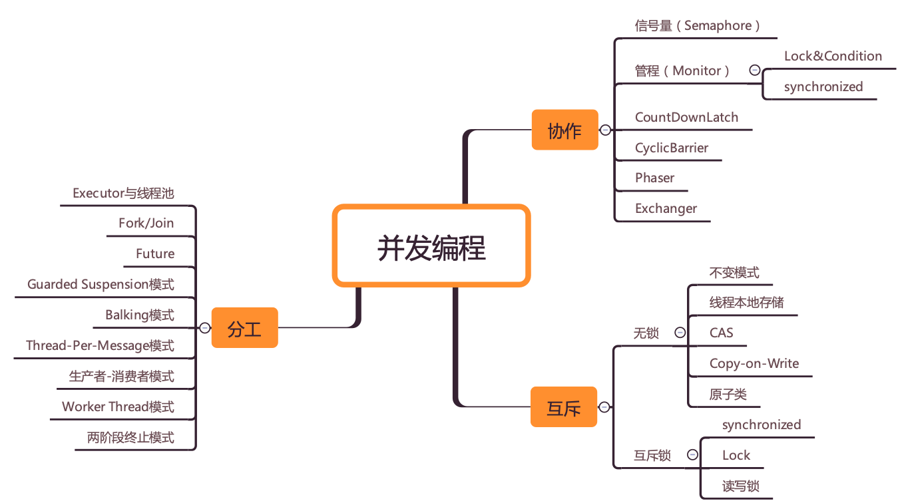
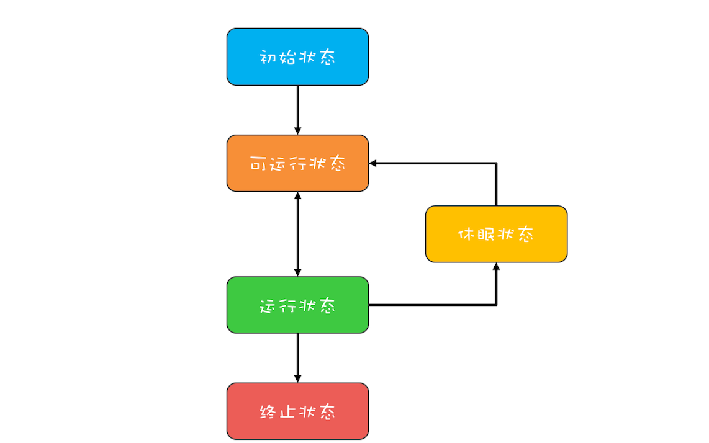
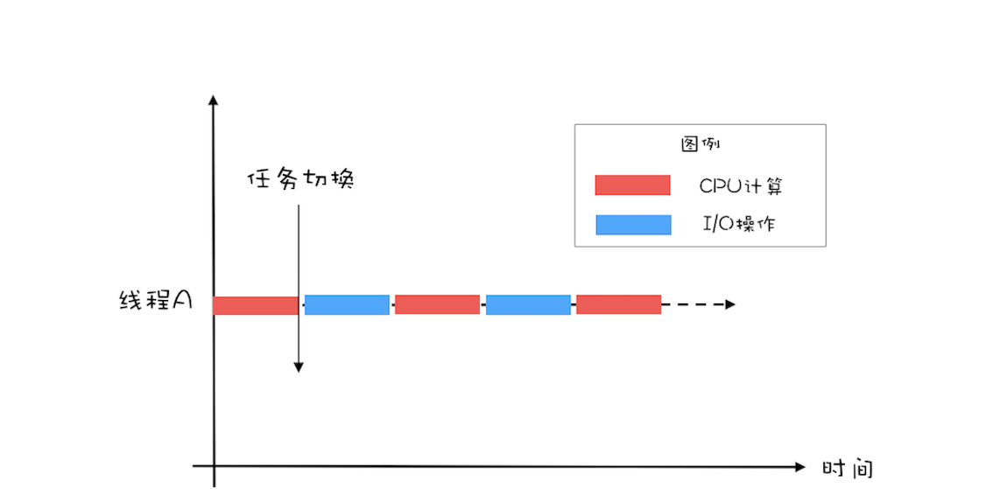
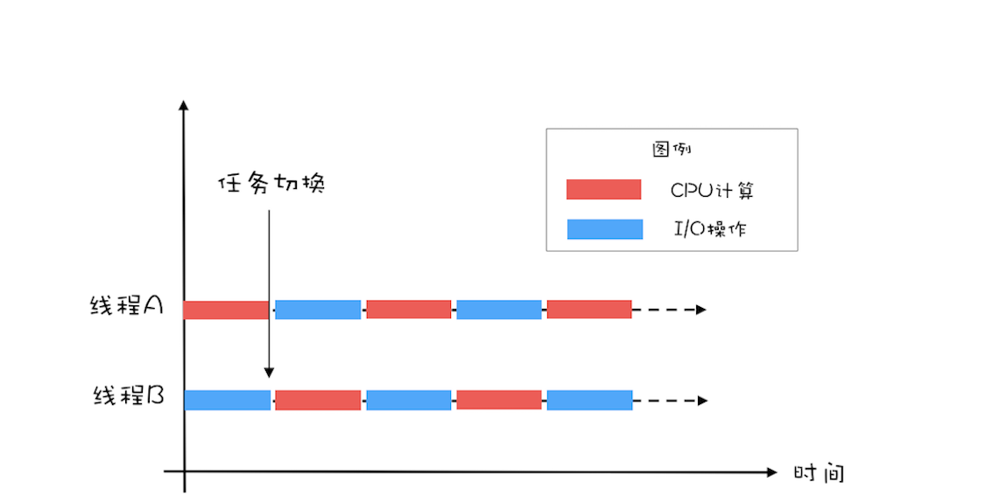

# Java 并发编程

[TOC]

## 0 并发编程概述

### 并发编程的三个核心问题

- 分工：任务的拆解，安排线程执行。
- 同步：被拆解的任务之间存在依赖，必须协调线程之间的关系保证程序的正确执行。
- 互斥：控制同一时刻只允许一个线程访问共享变量。


**并发编程全景图**



### 钻进去，看本质

&emsp;工程上的解决方案，一定要有理论作为基础。遇到一个问题一定要刨根问底，比如“它是从哪儿来的？”，是java的特有概念还是通用的概念。“它被提出的背景和解决的问题是什么？”等等。


## Java线程

### （1）Java线程的生命周期

&emsp;线程是操作系统并发理论中的概念，在Java的并发是通过多线程实现的。线程有它自己的从创建到消亡的过程，这个过程叫做声明周期。

#### 通用的线程生命周期：

- **初始状态：**线程被创建，还不允许分配CPU执行。因为这是编程语言特有的状态，在OS层面，线程还没有被创建。
- **可运行状态：**线程可以分配CPU执行。OS层面，线程已被创建。
- **运行状态：**分配到了CPU。
- **休眠状态：**运行态的CPU遇到了阻塞事件。
- **终止状态：**线程执行完或出现异常。



#### Java 线程生命周期

&emsp;Java 语言中线程共有六种状态，注意BLOCKED,WAITING,TIMED_WAITING是同一种状态，即休眠状态。

- **NEW**
  - 转换到RUNNABLE：
    - 继承Thread对象，重写run()方法，调用线程对象的start()；
    - 实现Runnable接口，重写run()方法，调用线程对象的start()。
- **RUNNABLE**
  - 转换到BLOCKED：线程等待synchronized的隐式锁，得到锁时又转换回RUNNABLE。
  - 转换到WAITING：
    - 获得synchronized的线程，调用无参的Object.wait()；
    - 调用无参的Thread.join()；
    - 调用LockSupport.park()方法。
  - 转换到：TIMED_WAITING：
    - 调用带超时参数的Thread.sleep(long millis)方法；
    - 调用带参数的Object.wait()；
    - 调用带参数的Thread.join();
    - 调用带参数的LockSupport.parkNanos();
  - 转换到：TERMINATED状态：
    - 线程顺利执行完 run() 方法；
    - 线程执行异常，导致线程终止；
    - 强制中断run()的执行：
      - interrupt()，通知线程线程要被终止。通过异常的方式获得通知；主动检测获得通知。
      - stop()，直接杀死线程，如果线程持有ReentrantLock锁，由于它不释放该锁，因此其它线程也获取不到这个锁了。不推荐使用。
- **BLOCKED**
- **WAITING**
- **TIMED_WAITING**
- **TERMINATED**


### （2）创建多少个线程合适？

&emsp;使用多线程，本质是提升程序性能：降低延迟和提高吞吐量。实现路径是可以通过优化算法和提高硬件的利用率。而并发编程提升性能的本质就是提升CPU和I/O设备的利用率。

#### 单线程与多线对比：

- 假设CPU计算和I/O操作的耗时是1：1，单线程情况下，CPU计算和I/O操作无法同时执行，所以CPU和I/O设备的利用率都是50%。



- 如果有两个线程，当A执行CPU计算的时候，让B执行IO操作，反之亦然，此时两者都没有空闲的时候，CPU和IO的利用率都达到了100%。



#### 创建多少线程合适？

- **CPU密集型：**多线程本质是提高CPU的利用率，如对于1个4核的CPU，每个核一个线程，理论上创建4个线程就足够了，多了也只是增加线程切换的成本。工程上一般会多创建1个，这个额外的线程用于当其它线程出现阻塞时使用。

- **I/O密集型：**与程序中CPU计算和IO操作的耗时比相关。如CPU计算和IO操作的耗时是1：1，则创建两个线程即可，如果是1：2，则3个线程，依此类推可得公式：

  ```
  最佳线程数 = CPU核数 * [1 + (IO耗时 / CPU耗时)]
  ```

### 为什么局部变量是线程安全的？

#### 局部变量存在哪里？

&emsp;局部变量的作用域是在方法内部，当方法执行完则局部变量也就没用了，因此局部变量是放在方法调用栈中。

&emsp;每个线程都有自己独立的调用栈，因此局部变量都是各个线程所独有的，不会存在并发问题，因此是安全的。